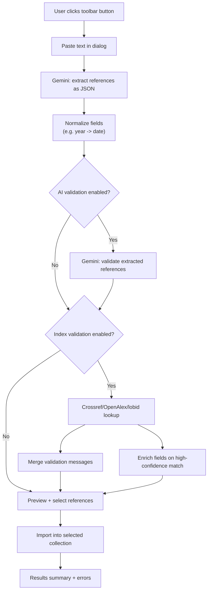

# Zotero Add Items from Text

A Zotero 7 plugin that extracts and imports literature references from unstructured text using Google Gemini AI.

## Features

- **Toolbar Integration**: Adds an icon-only button next to the identifier lookup tool
- **AI-Powered Extraction**: Uses Google Gemini to intelligently parse references
- **Multiple Reference Formats**: Handles journal articles, books, book chapters, conference papers, theses, and more
- **Validation (AI)**: Optional automated validation of extracted bibliographic data
- **Validation (Indexes)**: Optional checks against Crossref, OpenAlex, and lobid (hbz catalog)
- **Enrichment**: High-confidence index matches can fill/overwrite missing bibliographic fields (including author lists)
- **Preview Before Import**: Review and select which references to import
- **BibTeX Support**: View extracted references in BibTeX format
- **Collection-Aware**: Imports directly to your selected collection

## How it works



## Installation

1. Download the latest `.xpi` file from the [Releases](../../releases) page
2. In Zotero, go to Tools → Add-ons
3. Click the gear icon and select "Install Add-on From File..."
4. Select the downloaded `.xpi` file

## Configuration

1. Go to Zotero → Settings (or Preferences on macOS)
2. Navigate to the "Add Items from Text" tab
3. Enter your Google Gemini API key
   - Get a free API key at [Google AI Studio](https://aistudio.google.com/apikey)
4. Choose a Gemini model (default is `gemini-2.0-flash`)
5. (Optional) Enable bibliographic index validation/enrichment and configure `mailto` values for polite API usage

## Usage

1. Click the Add Items from Text toolbar icon (next to the identifier wand; hover tooltip shows the name)
2. Paste your text containing literature references
3. Click "Extract References"
4. Review the extracted references in the preview dialog
5. Select which references to import
6. Click "Import Selected" to import into your library

## Supported Reference Types

- Journal Articles
- Books
- Book Sections/Chapters
- Conference Papers
- Theses (PhD, Master's)
- Webpages
- Reports
- Preprints

## Notes

- **DOIs on books**: Zotero doesn’t allow a DOI field for all item types. If setting `DOI` fails, the add-on stores it as `DOI:<doi>` in the item’s `Extra` field.
- **Index enrichment policy**: When an index match is very high confidence (e.g. DOI match), the add-on may overwrite core bibliographic fields to align with the authoritative record.

## Development

### Prerequisites

- Node.js 18+
- npm or pnpm

### Setup

```bash
# Install dependencies
npm install

# Build the plugin
npm run build

# Watch for changes during development
npm run watch
```

### Project Structure

```
├── addon/                 # Plugin assets
│   ├── bootstrap.js       # Zotero 7 bootstrap entry point
│   ├── manifest.json      # Plugin manifest
│   ├── content/           # XUL/XHTML content
│   └── locale/            # Localization files
├── src/                   # TypeScript source
│   ├── index.ts           # Main plugin class
│   ├── config.ts          # Configuration
│   ├── preferences.ts     # Preferences management
│   ├── gemini.ts          # Gemini API integration
│   ├── indices.ts         # Crossref/OpenAlex/lobid validation & enrichment
│   ├── bibtex.ts          # BibTeX utilities
│   ├── import.ts          # Zotero import service
│   └── ui.ts              # UI components
├── scripts/               # Build scripts
└── build/                 # Build output
```

### Building

```bash
npm run build
```

The built plugin will be in the `build/` directory as a folder that can be loaded directly or packaged as `.xpi`.

### Creating XPI Package

```bash
cd build
zip -r ../add-items-from-text.xpi *
```

## Privacy

This plugin sends your pasted text to Google's Gemini API for processing. If enabled, it also queries bibliographic indexes (Crossref, OpenAlex, lobid) using extracted metadata (e.g., title/DOI). No data is stored or shared beyond what's necessary for these API calls. Please review the providers’ terms for more information.

## License

AGPL-3.0-or-later

## Contributing

Contributions are welcome! Please open an issue or submit a pull request.

## Acknowledgments

- Built for [Zotero 7](https://www.zotero.org/)
- Powered by [Google Gemini](https://deepmind.google/technologies/gemini/)
