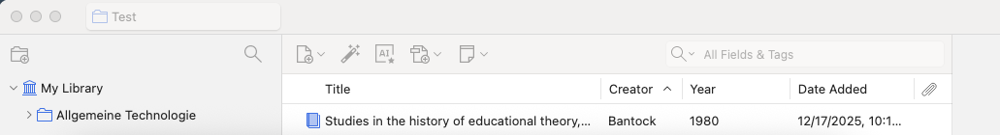
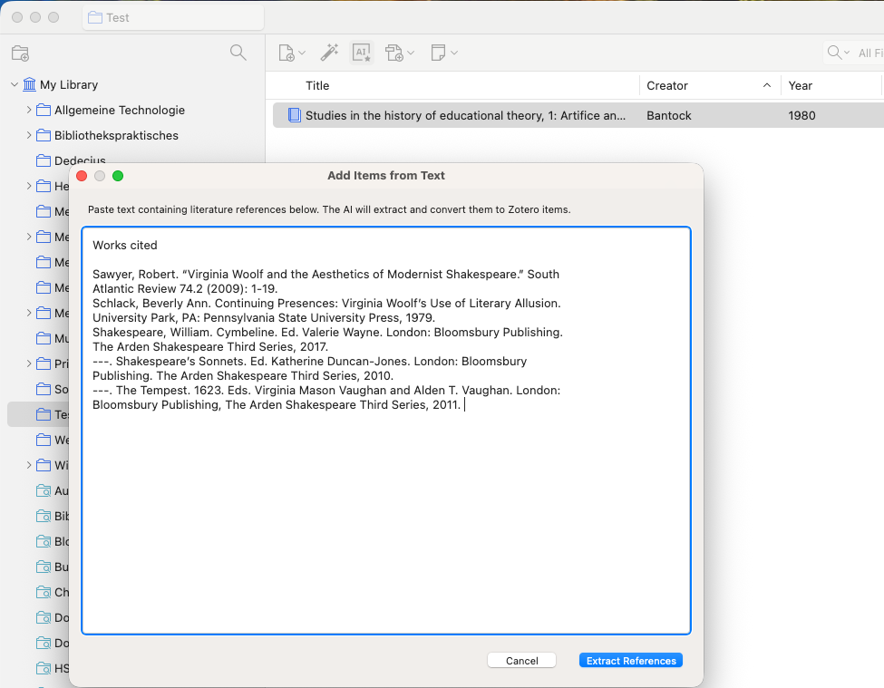
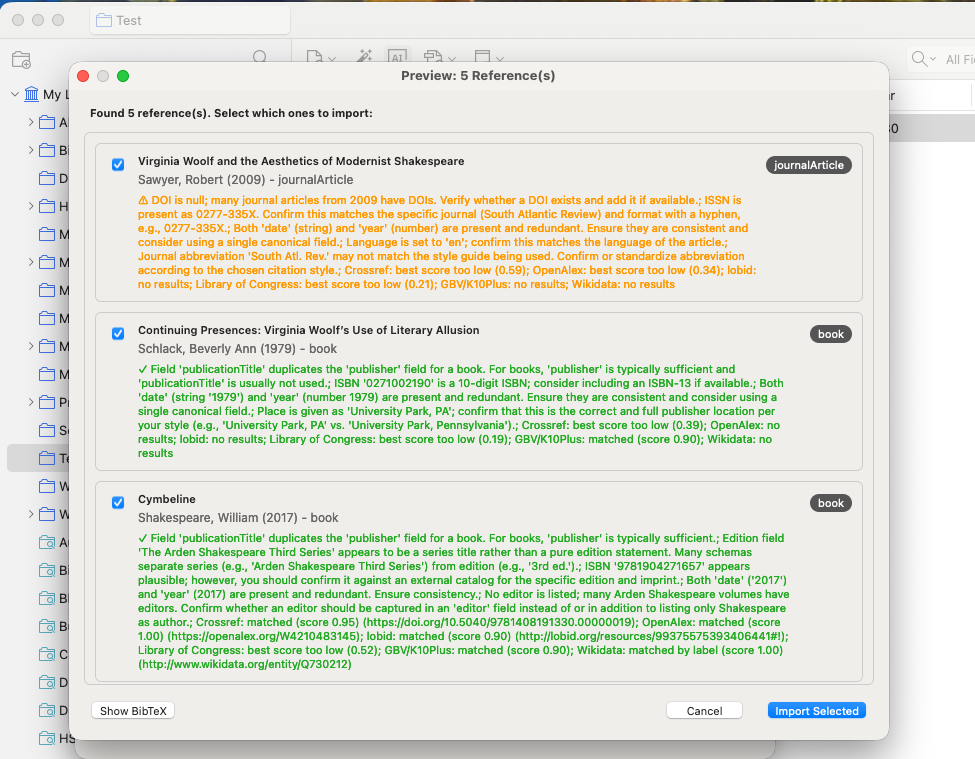

# Zotero Add Items from Text

A Zotero 7/8 plugin that extracts and imports bibliographic references from unstructured text using a configurable AI provider (Gemini, OpenAI-compatible, or Ollama).

## What it does

- Adds a toolbar button next to the identifier lookup tool
- Extracts references from pasted text with an AI provider
- Optionally validates and enriches results via bibliographic indexes
- Lets you preview, select, and import items into your current collection
- Includes a BibTeX preview of extracted items

## Quick start

1. Install the add-on from the latest `.xpi` release.
2. Open Zotero settings and configure an AI provider.
3. Click the toolbar button, paste your references, and click "Extract References".
4. Review the preview and click "Import Selected".

## Screenshots

Toolbar button:

Text input dialog:

Extraction preview:

