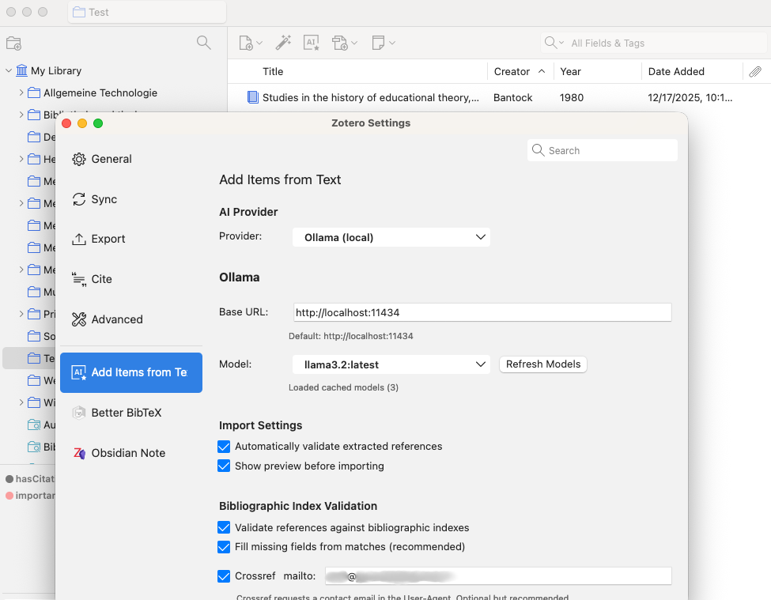
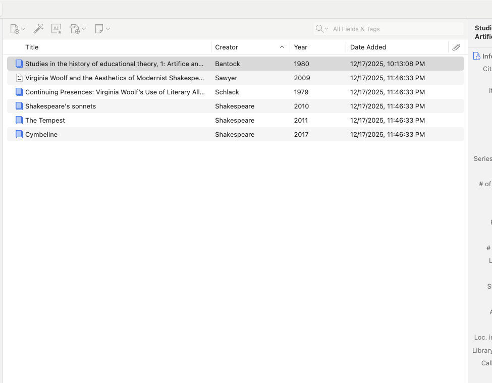

# Usage

## Step-by-step

1. Click the Add Items from Text toolbar button (next to the identifier wand).
2. Paste any unstructured text that contains references or bibliographic details.
3. Click "Extract References".
4. Review the preview list and select the items you want.
5. Click "Import Selected" to add them to your current collection.

## Tips for best results

- Include full titles and author names when possible.
- Mixed formats are fine, but keep one reference per line if you can.
- If results look off, try removing extra prose or headings from the pasted text.

## Interface tour

Toolbar button:

Settings dialog:

Text input dialog:

Preview and selection:

Imported items:

